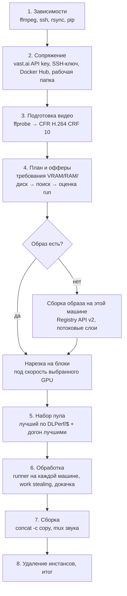

# vast_upscale.py — архитектура (v1.6)

Один файл на Python 3.10+ (только стандартная библиотека), ~7 000 строк. Внутри — семь слоёв: локальная подготовка видео, планирование и оценка офферов, сборка образа без Docker, оркестрация пула инстансов vast.ai, удалённые скрипты (bootstrap/runner), потоковая передача и докачка, состояние и фоновый режим. Ниже — как они устроены и как связаны.

## 1. Общая схема запуска

Этапы 1–4 и 7–8 выполняются в основном потоке. Этапы 5–6 — многопоточные: у каждого инстанса свой поток (`hedge_main`/`worker_main`), основной инстанс мониторится из главного потока, скачивание результатов идёт в потоке `Downloader` на каждый инстанс, генерация слоёв образа — в потоке `layer-gen`. Весь вывод идёт через `_raw_print` с потоковым префиксом (`_tls.prefix`, например `[W1 RTX 4090]`) и «доской» прогресса воркеров (`Orchestrator.board`), которую основной прогресс-бар показывает хвостом строки (там же `пул: нужно N · активно A · разворачивается P` и `рынок: …`). `Spinner` (ожидание контейнера, SSH, возврата машины) держит время последнего изменения статуса и печатает его перед текстом; одинаковый статус не дублируется: в терминале строка обновляется на месте, без терминала (`--daemon`, лог) выводится только при изменении; `ProgressBar` без терминала тоже печатает только при изменении показателей.

## 2. Данные

**`VideoInfo`** — результат `ffprobe` (размер, fps с учётом VFR, кадры, кодек, pix_fmt, звук, 10-бит).

**`Job`** — единица работы. Исторически это файл; с v1.6 это ещё и **блок** файла: поля `block_of` (имя родителя), `block_idx/block_total`, `block_start/block_frames` (диапазон кадров в исходнике), `block_ctx` (кадры контекста спереди, выход которых отбрасывается). У родителя, порезанного на блоки, `status = "split"` и список `blocks`. Всё остальное — `converted` (локальный вход: CFR-копия файла или сегмент блока), `remote_in/remote_out` (пути в контейнере), `status` (`pending → uploaded → done → downloaded → finished` | `failed` | `skipped` | `split`), `assigned_to` (тег машины: `main`, `W1 …`, `pending-W1` на время переезда), `in_transfer`, `downloaded` (локальный результат). Блок — это обычный `Job`, поэтому очередь, загрузка, переезд между машинами, work stealing, докачка и `--resume` ничего о блоках не знают.

**`Plan`** — сводка для оценок: список заданий, целевое разрешение, суммарные кадры/байты, оценки каналов, диск, критерий, `Requirements` (VRAM/RAM/диск по мегапикселям выхода и модели).

**`Candidate`** — оффер + вид аренды + цена (для interruptible — `min_bid × (1+--bid-margin)`) + модель (`pick_model` по VRAM: 3B fp16 / 7B fp16 / 7B fp8 с blockswap) + оценки времени и стоимости всего run (`estimate_candidate`: запуск+pull, установка, загрузка, обработка по профилю GPU в с/кадр, скачивание, диск и трафик).

**Состояние** (`<workdir>/state.json`): инстанс, оффер, модель, `split` (размер блока и контекст), статусы всех заданий с локальными путями результатов, воркеры. Пишется атомарно при каждом изменении (`Session.save_state`), воркеры пишут через родителя.

**Файлы**: рабочая папка скрипта (`--cache-dir`, спрашивается при первом запуске, хранится в `~/.config/vastai/vast_upscale_settings.json`) содержит кэш сборки образа (`models/`, `seedvr2-src/`, `pylib-py3.11/`, `wheelhouse/`, `ffmpeg-bin/`, `layers/*.json` с digest готовых слоёв и `layers/upload-*.json` с сессиями загрузки, `build.log`, `crash.log`) и папки запусков `runs/<имя>-<hash>/` (CFR-копия, сегменты блоков `<имя>.bNNN.cfr.mp4`, скачанные результаты `*.up.mp4`, `state.json`, `run.log`, `progress.json`).

## 3. Планирование (этап 4)

`estimate_requirements` считает мегапиксели выхода и по модели VRAM (`VRAM_MODEL`: базовые ГБ + ГБ/кадр/МП, с тайлингом VAE и без) — минимальные VRAM и RAM для 3B и 7B, плюс диск (образ, веса, вход/выход, PNG-буфер блоков). `build_offer_query` превращает это в фильтры API (`gpu_ram`, `cpu_ram`, `disk_space`, CUDA, надёжность, сеть, страна, цена). `search_candidates` запрашивает on-demand и bid, для каждого оффера строит `Candidate` и сортирует по критерию `--optimize` (по умолчанию `cost` — минимальная стоимость всего run; `ratio`, `balanced`, `speed`). При управлении пулом стартовая машина выбирается по DLPerf/$ (`offer_value`: `dlperf/цена`, иначе `TFLOPS/цена`) — тем же показателем, по которому пул потом обновляется. Меню (`interactive_offer_selection`) и подтверждение заказа — только с `--interactive`.

Размер чанка (`block_frames_for`): не длиннее `--block-seconds` (8) секунд при fps файла (`--block-frames N` — явно, но не длиннее того же предела; `0` — без чанков); файл длиннее предела делится на равные чанки (`split_into_blocks`). Раскладка зависит только от файла и настроек — одинакова между запусками, поэтому готовые чанки переиспользуются из кэша (`chunk_requirements` → `chunk_cache_dir`: `<кэш>/chunks/<имя>-<hash требований>`, `restore_cached_chunks` помечает блоки с маркером `.json` как `downloaded`).

## 4. Сборка образа без Docker (класс `Prebuild`, `RegistryClient`)

Цель — чтобы оплачиваемое время инстанса не уходило на установку: образ = базовый `pytorch/pytorch:2.8.0-cuda12.8-cudnn9-runtime` + слой софта + слой весов, тег `seedvr2-<модель>-<коммит>-<hash базы>` в вашем репозитории Docker Hub.

`RegistryClient` — клиент Docker Registry HTTP API v2 на `urllib`: токены по scope (`auth.docker.io`), заголовки ответов приводятся к нижнему регистру (Docker Hub отдаёт их так), манифесты (docker/OCI, списки платформ), blob-ы (HEAD/GET с докачкой), cross-repo mount, сессии загрузки (POST → Location; GET Location → принятый объём), PUT с digest.

`build_local`:

1. Манифест и конфиг базового образа читаются, его слои **монтируются** в ваш репозиторий (`POST …/uploads/?mount=&from=`) — ничего не скачивается; запасной путь — скачать/загрузить с докачкой.
2. Слой софта: исходники SeedVR2 закреплённого коммита (tarball GitHub), зависимости под Python контейнера (`cross_install_packages`: `pip install --dry-run --report … --platform manylinux_2_17…2_35 --python-version 3.11 --only-binary=:all:` с constraints на torch базового образа; пакеты без wheel на PyPI, например `antlr4-python3-runtime`, собираются локально в `wheelhouse`; результат — `pylib-py3.11/` с маркером `.done` и `.pyver`), статический ffmpeg, `env.sh` (PATH/PYTHONPATH с проверкой версии Python), `.prebuilt`.
3. Слой весов: если он уже опубликован — под этим или прежним тегом (`layer_without_inputs` → `find_layer_in_registry`: теги репозитория через Hub API, манифест и конфиг, слой узнаётся по записи `weights <модель>` в history, версия сборки ≥ 1.6.0) — берётся его digest/diff_id, и веса даже не скачиваются на эту машину; иначе файлы модели скачиваются в кэш с докачкой по Range и проверкой sha256 (`download_with_resume`), в слой идут прямо из кэша, с маркерами `.sha256ok` и `.validation_cache.json` (чтобы CLI не пересчитывал хеши).
4. Конфиг образа = конфиг базы + новые `diff_ids` + `Env` (`PATH=/opt/vu/bin:…`, `PYTHONPATH=/opt/vu/pylib`) + метки; манифест публикуется последним — только после него заказывается инстанс.

**Потоковые слои** (`write_layer_stream` → `_ChunkSink` → `upload_layer_stream`): tar (GNU, фиксированные mtime/uid/gid) → gzip (уровень 0 для весов, 1 для софта; без имени файла и с фиксированным временем) → sha256 — всё на чистом Python, без временных файлов, в потоке `layer-gen`; куски по 4 МБ через очередь уходят в **один PATCH с `Transfer-Encoding: chunked`** (как `docker push`). Память ≈ 3 куска. Большие файлы читаются блоками по 4 МБ (`_ReadProgress`, важно для 9p/drvfs в WSL2) со сбросом page cache каждые 256 МБ (`posix_fadvise`). Поток байт детерминирован (проверено бит-в-бит), поэтому **докачка**: сессия (`layers/upload-<слой>.json`: Location, объём, sha256 каждого куска) сохраняется по ходу; после обрыва сервер спрашивается, сколько принято, слой регенерируется, принятая часть сверяется по хешам и пропускается, PATCH продолжается с этого места; при потере сессии — заново. Готовый слой запоминается в `layers/<слой>.json` (digest, diff_id, отпечаток входа): при совпадении отпечатка и наличии blob в реестре слой не собирается вовсе; слой весов один на модель и подходит любому тегу, а без digest-кэша (`publish_layer(reuse_from=…)`) ищется в уже опубликованных образах репозитория — смена схемы тегов или версии Python не заставляет грузить 7–17 ГБ заново.

Проверка места (`check_build_disk`) учитывает WSL2: если кэш внутри `ext4.vhdx` (та же ФС, что `/`), проверяется свободное место на диске Windows C:, где растёт этот виртуальный диск.

## 5. Удалённая сторона: `bootstrap.sh` и `runner.py`

Оба скрипта генерируются скриптом и заливаются по SSH (`SSH.write_file`); запускаются через `setsid nohup … &` с pid-файлом, поэтому переживают обрывы SSH; состояние — файлы (`bootstrap.status`, `status.json`), которые скрипт опрашивает.

`bootstrap.sh`: находит python с torch (`/opt/conda/bin/python3` …), экспортирует `PY`, подключает `/opt/vu/env.sh`. **Предсобранный образ** (`VU_PREBUILT=1`): только проверка по пунктам (веса нужной модели, маркеры sha256, `inference_cli.py`, ffmpeg, импорт зависимостей) с диагностикой в лог, никаких скачиваний; веса на месте без маркера — sha256 пересчитывается на инстансе (`weights_ok`/`mark_ok`); если чего-то нет — доустанавливается **только это** (apt при нехватке инструментов, clone — только без `.commit`, pip — только если импорт не проходит), а отсутствие или несовпадение весов нужной модели означает не тот образ: `FAIL prebuilt-verify`, инстанс удаляется (`PrebuiltBroken`); при `--instance`/`--resume` на инстансе из своего репозитория `Session.prebuilt` выставляется по имени образа. Базовый образ проходит те же шаги, пропуская всё, что уже есть; веса — с докачкой и маркерами. `env.sh` сравнивает версию Python контейнера с той, под которую собран `pylib` (`.pyver`): при несовпадении `pylib` убирается из `PYTHONPATH`, и зависимости ставит pip.

`runner.py` (`RUNNER_PY`, рендерится с `VRAM_MODEL`): читает `jobs.json` **перед каждым заданием** (оркестратор может забрать или добавить задания на лету), для задания подбирает `batch` по свободной VRAM (`nvidia-smi`) и мегапикселям выхода, `chunk_size` — по лимиту RAM контейнера (cgroup), запускает `inference_cli.py` и разбирает строки прогресса (`Encoding/Upscaling/Decoding batch i/N`, `Chunk i/N`, `Average FPS`), пишет `status.json` раз в секунду; лестница повторов при OOM VRAM (tiled VAE → batch/2 → blockswap 16 → batch 5 + blockswap 32 + swap_io) и при SIGKILL по RAM (чанк вдвое меньше). Для **блока** CLI пишет PNG (`--output_format png`), runner отбрасывает `ctx` первых кадров и кодирует остальное тем же кодером и параметрами, что и CLI (`libx264 -pix_fmt yuv420p -preset medium -crf 12`), удаляет PNG. Готовый результат помечается `<out>.done` с размером и sha256.

## 6. `Session` — одна машина

`provision` (заказ по офферу, ожидание `running` с учётом `status_msg`, SSH напрямую или через прокси, проверка полосы `check_link` — медленнее `--min-link` удаляется и берётся следующий оффер), `bootstrap` (запуск и мониторинг `bootstrap.sh` по статус-файлу, идемпотентно), `upload` (rsync `--partial --inplace`, а без rsync на образе — `pipe_transfer` через ssh с докачкой `tail -c +N`), `write_jobs_and_start_runner`, `monitor_and_download` (опрос `status.json`, прогресс с ETA, события OOM, постановка готовых в `Downloader` сразу по маркеру `.done`, перезапуск умершего runner-а, `ensure_alive` при недоступности), `destroy` (идемпотентно между потоками). `adopt(other)` переносит поднятый инстанс от сессии-кандидата к основной (набор пула).

**Прерывание** (`ensure_alive` → `try_resume`): инстанс не `running` и не остановлен нами → `interrupted=True`, первый вызов уведомляет оркестратор (`on_interrupt`: чанки машины — в очередь, замена, потолок бида), дальше цикл ожидания: раз в 5 с `raise_bid` (к `min_bid` машины с запасом `--bid-margin`, иначе +3 %, не выше `bid_cap` — цены соседнего взятого оффера, иначе `--max-price`/+5 %); повторные вызовы из других потоков (докачка) просто ждут. Возврат: SSH заново, `rewrite_jobs` (очередь на машине — только то, что ещё её) и `start_runner`. Не вернулся за `--resume-timeout` → `on_lost`: инстанс удаляется, пул продолжает (если машин не осталось — замена по регулятору на ближайшем скане).

**Очередь и подгрузка.** `WorkQueue` (в оркестраторе) — все чанки в порядке файлов/блоков; `Session.feed()` на каждом опросе берёт из неё (`pull`) столько чанков, чтобы подгруженных заранее (`preloaded`: загружены, не начаты) было не больше `slots()` = число видеокарт инстанса, загружает их (`upload(quiet)`), дописывает `jobs.json` и будит runner. `push_front` возвращает чанки в голову очереди (сохраняя исходный порядок). Цикл `monitor_and_download`: подгрузка → опрос `status.json` → готовые в `Downloader` → перезапуск умершего runner-а → у основного `Orchestrator.on_poll` и бар очереди (`render_queue`: кадры всех чанков, `done_frames` с долей текущих, ETA по `WorkQueue.rate()` — фактической скорости пула за 10 минут) → условия выхода (воркер: нет своих чанков и очередь пуста 60 с, либо `retired`, либо всё готово; основной: `all_done()`). Runner в контейнере не выходит, а ждёт заданий (`idle`), пока не появится файл `stop` (`stop_runner`) и выходит сам, если его `runner.pid` перезаписан другим процессом или удалён.

**Недоступность.** Воркер ждёт возврата в своём потоке (`ensure_alive` → `try_resume`). У основного ожидание идёт в фоне (`wait_back_async`): общий цикл продолжает управлять пулом и рисовать очередь; вернулась — продолжает; не вернулась — `on_lost` (чанки уже в очереди, инстанс удаляется), и поток основного остаётся координатором до конца очереди (`lost`). Раз в `--pool-scan` `Orchestrator.check_instances` сверяет пул со списком инстансов аккаунта: пропавший два скана подряд → `external_lost` (чанки в очередь, замена по регулятору), не `running` → `external_stopped` (путь прерывания).

`Downloader` — поток на сессию: докачка результатов бесконечными повторами, пока жив контейнер, проверка размера и sha256 по маркеру; чанк пишется прямо в кэш чанков (`chunk_cache_store` кладёт маркер `.json`), затем `on_downloaded` → `Assembler.notify`: если все чанки видео скачаны, оно собирается в отдельном потоке сразу (`assemble_blocks` → `mux_audio` → `chunk_cache_clear`).

## 7. `Orchestrator` — пул машин

Метрика — DLPerf/$ (`Session.value()`); правила:

* **Набор первичного пула** (`acquire_pool`): заказывается лучший оффер (при `--pool-size N` — сразу N лучших); пока ни одна машина не готова, каждые `--pool-scan` (15 с) перезапрашивается листинг (`list_market`: те же фильтры и требования), и оффер лучше лучшего из заказанных в `--pool-improve` (1.3) раз заказывается тоже (до 1+`--max-workers` одновременно). Кандидаты поднимаются в потоках `hedge_main`; первый прошедший установку становится основным (`primary.adopt`), остальные ждут выбора и работают воркерами (`worker_serve`: забирают блоки у худших либо, если работы нет, удаляются); не поднявшийся за `--boot-deadline` (10 мин) удаляется; неудачные заказы заменяются следующими по списку, лимит — `--max-attempts`.
* **Скан рынка** (`scan_market`, каждые `--pool-scan` из цикла мониторинга основного или по клавише `r` — тогда с печатью вердикта): лучший оффер берётся в пул, если он лучше худшей *готовой* машины в `--pool-improve` раз (или готовых меньше `--pool-min`, или активных — готовых + разворачивающихся — меньше `--pool-size`) и очередь не пуста; при улучшении — если новичку по его доле скорости достанется не меньше `--min-worker-minutes` (`try_spawn`), при нехватке — принудительно; заказов одновременно — сколько не хватает до `--pool-size`. Новая машина ничего не получает заранее — она сама берёт чанки из очереди.
* **Регулятор** (`pool_size`, `set_pool_size`, `pool_status`): `--pool-size N` и клавиши `+`/`-`/`s` (`PoolKeys`: поток, cbreak-режим терминала на этап 6, только в TTY и не в `--daemon`); активных больше требуемого → худшие выбывают (не ниже `--pool-min`).
* **Прерывание машины** (`on_interrupt`): её чанки (текущий и подгруженные) — `push_front` в очередь; если она была единственной готовой и очередь не пуста — `list_market` → лучший оффер → `spawn_worker`; потолок бида — цена этого оффера, иначе ближайшей по DLPerf/$ машины пула. `on_lost` → инстанс удаляется, очередь ждёт свободную/новую машину.
* **Ребаланс** (`rebalance`, при подключении `on_ready`, выбывании, отключении): чанки в процессинге не трогаются; если очередь пуста и есть свободная машина, подгруженные, но не начатые чанки других машин (`reclaim`, с проверкой гонки с runner-ом) возвращаются в очередь. `check_instances` — сверка со списком инстансов аккаунта (удалённые/остановленные в обход скрипта).
* **Переиспользование** (`find_our_instances`, `adopt_existing`, `hedge_main(existing=True)`): работающие инстансы с меткой `vast_upscale` и нашим образом, не занятые живыми демонами (`instances_in_use` по реестру и их `state.json`), подключаются в пул без заказа; при пустом рынке из них синтезируются кандидаты (`_existing`), чтобы этап 4 не прерывался.
* **Выбывание** (`evaluate_pool`): худшая машина помечается `retired`, если есть готовая лучше её в `--pool-improve` раз и после ухода останется ≥ `--pool-min` готовых (прерванные готовыми не считаются); её неначатые блоки переезжают на лучшую (`transfer`: с проверкой гонки с текущим заданием runner-а; у прерванного источника — без SSH), сама она удаляется, закончив текущий блок; основной тоже может выбыть — тогда удаляется, не дожидаясь воркеров.
* `state_extra` кладёт воркеров и очередь в `state.json`.

## 8. Сборка: сразу по готовности и этап 7

`Assembler` (создаётся после нарезки, `Session.on_downloaded` у основного и через `parent` у воркеров): как только все чанки видео `downloaded` — в отдельном потоке `assemble_blocks` (`ffmpeg -f concat -c copy`, число кадров сверяется с суммой блоков, запасной проход с `+genpts`) → `mux_audio` (звук из исходника AAC 192k, `-shortest`) → `<имя>_1080p.mp4` рядом с исходником → `chunk_cache_clear` (все чанки этого видео удаляются из кэша). Этап 7 ждёт эти потоки (`Assembler.wait`), дособирает то, что не успело (например, всё из кэша без GPU) и подводит итог. Любой упавший блок = упавший файл с перечислением блоков; чанки такого видео остаются в кэше до следующего запуска.

## 9. Возобновление, фон, аварии

Готовые чанки живут в кэше чанков независимо от `state.json`: любой следующий запуск с теми же исходником и требованиями (и без `--resume`) берёт их оттуда, пересчитывает недостающие, а если готово всё — GPU не заказывается. `--resume` дополнительно читает `state.json` (папка запуска выводится детерминированно из пути входа): статусы «загружен/обработан» восстанавливаются только на прежнем инстансе; раскладка чанков детерминирована (файл + настройки), сегменты `.bNNN.cfr.mp4` переиспользуются.

`--daemon` (двойной fork, лог `run.log`, `progress.json`, реестр демонов `~/.config/vastai/vast_upscale_daemons.json`), `--attach/--status/--stop`; SIGTERM → как Ctrl+C: инстансы удаляются. Под WSL2 фоновый процесс живёт только при открытом окне. `--clear-chunks` (`chunks/` + `runs/`) и `--clear-cache` (вся рабочая папка) — `cmd_clear`, с подтверждением и отказом при живых демонах.

Ошибки: `FatalError` (и `RegistryError`) печатаются как сообщение, неожиданные исключения — в `<кэш>/crash.log`; в `finally` основной цикл останавливает воркеры и спрашивает (45 с) об удалении основного инстанса.

## 10. Тесты (`tests/`, без vast.ai и GPU)

Локальный `sshd` на 127.0.0.1:2222 изображает контейнер, `inference_cli.py` подменён фейком с теми же строками прогресса (умеет OOM и PNG-выход), API vast.ai и Docker Hub замоканы (мок-реестр отдаёт заголовки в нижнем регистре и умеет рвать соединение посреди потока). Покрытие: планирование и dry-run, интерактивное меню, сопряжение с Docker Hub, кросс-платформенный pip, рабочая папка, потоковая генерация слоёв, сборка образа с обрывами и докачкой, полный конвейер с OOM и обрывом скачивания, `--resume`, передача без rsync, пул (дорогой основной выбывает), чанки (нарезка, границы, сборка по готовности, кэш между запусками), чанки на пуле, набор пула без ожидания, прерывание по цене (замена, бид раз в 5 с до потолка, возврат / потеря), регулятор `--pool-size` и клавиши, Spinner без дублей, переиспользование своих инстансов и удаление в обход скрипта, фон.
